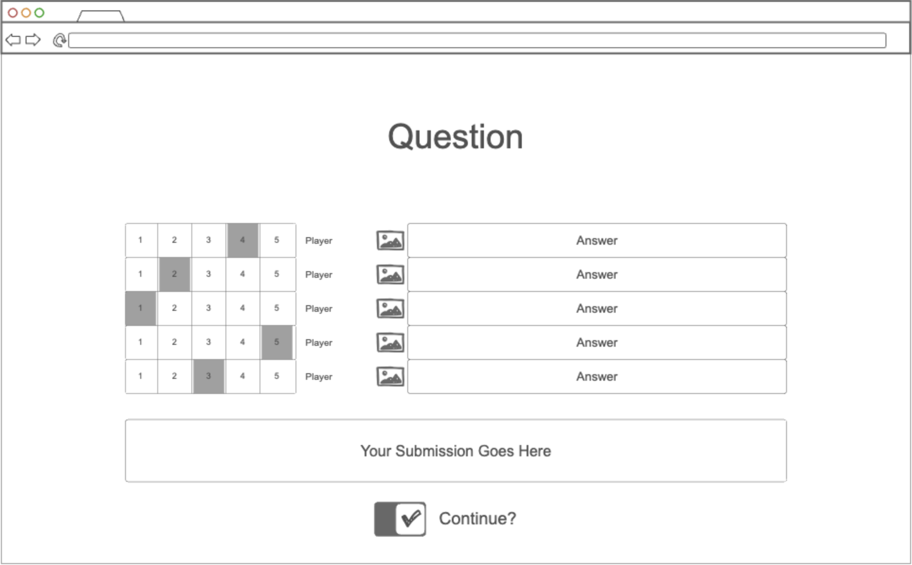

# Odd One Out

This is a web application for playing a game of Odd One Out with a group of users 
and a Chatbot.

## Specification Deliverable

### Elevator Pitch

Can a group of regular people figure out which one of them is an AI? Odd One Out 
is a game where each player tries to figure out who the AI is and vote them out 
without getting voted out themself. Each round, every player submits a question. 
One of those questions is then presented to the group to answer. Each player then 
gets to vote out who they think is the AI. Each remaining player then votes to 
continue or halt the game. If the AI is still in when the game ends, the players 
lose. Otherwise, the remaining players win.

### Design

### Key Features

- Secure login over HTTPS
- Game Match-Making
- Q/A Collection and Distribution
- Ranked Choice Voting Algorithm
- Restriction of gameplay to authenticated users
- Non-interactive gameplay for voted-out players

### Technologies

I will use the required technologies on the following ways

- HTML - Uses correct HTML structure for the application: one login page and one 
gameplay page.
- CSS - Uses application styling that is appealing across various device formats, 
uses good whitespace, color choice, and contrast.
- React - Provides login, q\a submission, player answer display, applying votes, 
display removed player, display results, and use of React for routing and 
components. 
- Service - Backend service with endpoints for
    - Login
    - Submitting Questions
    - Random Question Selection
    - Submitting Answers
    - Retrieving Answers
    - Submitting Votes
    - Retrieving Voting Results
    - Retrieving Results
- DB - Stores player data and game data in a database.
- Authentication - Register and login players. Restrict gameplay and 
participation to authenticated players only.
- WebSocket - As players submit questions, they are collected for one to be 
distributed to all players. As players submit answers, they are displayed to 
other users in real time.

## HTML Delivarable

- HTML Pages - 5 HTML pages: about, home, load, play, stats.
- Links - All pages have links to other pages except those requiring login.
- Text - Each voting choice, prompt, response, timer is represented by a text 
box.
- Images - I created a logo for the site.
- Login - Input boxes and buttons for login and registration/
- DB - Login references database data. Prompts and responses pushed to and 
pulled from the database.
- WebSocket - Prompts, responses, and votes are distributed in real time.

## CSS Deliverable

- Header, Footer, Main - All present for all pages.
- Navigation - Dropped underline and set the logo to be the home nav.
- Responsive to Window Sizing - Looks good.
- Application Elements - Good spacing and contrast. Relative location is 
sufficient but could be improved.
- Application Text Content - Readable and Consistent.
- Application Images - Centered and Scaled for proper context.

## React Deliverable

- Bundled and Transpiled - done.
- Components - login, lobby, play, stats, about are all components with mocks for 
login.
    - login - filling the fields and logging in takes you to the logged-in home 
    page.
    - database - displays the stats which are currently fake but will be pulled 
    from and set in a database.
    - WebSocket - I used the setInterval to produce fake player connections to 
    the lobby and to produce fake interactions with the fake players which will 
    be replaced with WebSocket messages later.
    - logic - the question pool, answers map, kicked player ballot selection, and 
    continue vote all are affected by user input.
- Router - routing between login, lobby, play, and stats components.
- Hooks - uses const timers instead of useState to track count down times. Uses 
useEffect to manage gameState and authState dependent rendering and interactions. 
Uses useEffect to manage notifiers and handlers.

## Service Deliverable

- Node.js/Express HTTP Service - done!
- Static Middleware for front-end - done!
- Calls to 3rd part endpoints - done (openai)
- Backend service endpoints - placeholders for login and stats
- Frontend calls to service endpoints - done using fetch
